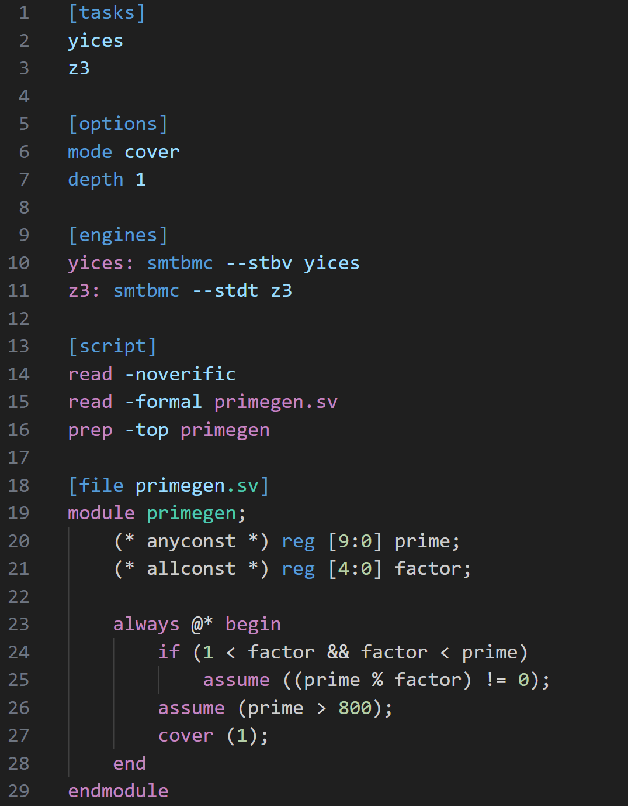

# SymbiYosys `.sby` Syntax Highlighting

This VSCode extension adds syntax highlighting support for [SymbiYosys](https://github.com/YosysHQ/sby) `.sby` files. Yosys script highlighting in `[script]` sections is supported with [yosys-vscode](https://github.com/lethalbit/yosys-vscode).

## Known Issues

Some sby sections and section arguments may not yet be implemented.

## Release Notes

### 0.1.0

Initial release.
